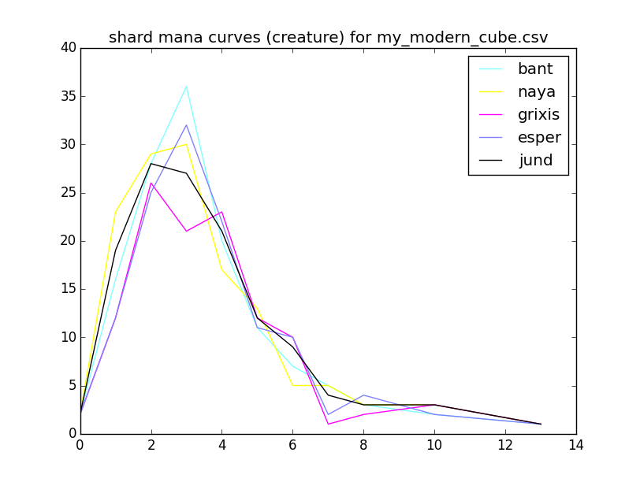
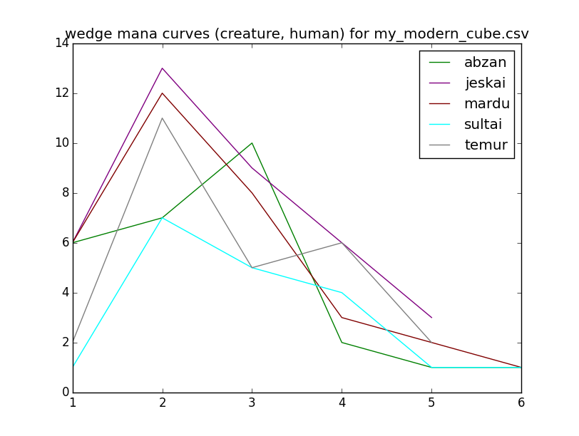

## Cubealyzer

A curve analysis tool for Magic: the Gathering cubes.



Mana curves are calculated for each color and combination of colors (guild,
shard, etc.) based on the number of creatures castable with only that mana.
This should be enough to get a general sense of the color balance for most
cubes, although some cards will not be counted (e.g., spells that make tokens
or creatures with alternative casting costs).

A cube file must be provided via the positional argument. This should contain
the cards appearing in the cube, one per line. If there are multiple copies of
a card, that line should be repeated. This format is compatible with
[cubetutor](https://www.cubetutor.com/) CSV output (columns after the first are
ignored).

Uses card data from the [Scryfall API](https://scryfall.com/docs/api/).

This data will be downloaded and stored in a JSON file with the same base name
as the CSV file (e.g., my_modern_cube.json for my_modern_cube.csv.) This allows
you to observe the result of incremental changes to a cube without unnecessary
API queries. These JSON files can grow rather unwieldy, so try deleting them if
you're having problems.

## Usage
```
usage: cubealyzer.py [-h] [-t [type]] [--subtype [subtype]] [-c] [-g] [-s]
                     [-w] [-n] [--plot] [--test] [-v] [-vv]
                     [FILE]

Curve analysis tool for Magic: the Gathering cubes.

positional arguments:
  [FILE]               The cube file (cubetutor CSV export)

optional arguments:
  -h, --help           show this help message and exit
  -t [type]            The card type to calculate curves for (default:
                       creature)
  --subtype [subtype]  The card subtype to calculate curves for (default:
                       none)
  -c                   Calculate curves for colors
  -g                   Calculate curves for guilds
  -s                   Calculate curves for shards
  -w                   Calculate curves for wedges
  -n                   Calculate curves for nephilim
  --plot               Display plots of generated curves
  --test               Generate tests
  -v, --verbose        Generate verbose output
  -vv, --debug         Generate debug messages (and also verbose output)
```

## Example

Using [psyllogism's Modern Cube](http://www.cubetutor.com/viewcube/75206):

```
$ ./cubealyzer.py -cg --plot my_modern_cube.csv
Total cards in:
black       176
blue        171
green       181
red         178
white       175
Cards of type creature per color in:
black       54
blue        47
green       60
red         52
white       58
Cards of type creature at each cost in:
black       0: 2 1: 3 2:11 3:11 4:11 5: 4 6: 6 7: 1 8: 2 10: 2 13: 1
blue        0: 2 1: 1 2: 9 3:12 4:10 5: 3 6: 5 7: 1 8: 1 10: 2 13: 1
green       0: 2 1: 8 2:12 3:16 4: 8 5: 3 6: 3 7: 3 8: 2 10: 2 13: 1
red         0: 2 1: 9 2:12 3: 7 4: 8 5: 5 6: 3 7: 1 8: 1 10: 3 13: 1
white       0: 2 1: 8 2:11 3:16 4: 7 5: 4 6: 3 7: 2 8: 2 10: 2 13: 1
Total cards in:
azorius     236
boros       241
dimir       233
golgari     246
gruul       246
izzet       238
orzhov      239
rakdos      240
selesnya    242
simic       240
Cards of type creature per guild in:
azorius     88
boros       90
dimir       81
golgari     96
gruul       93
izzet       80
orzhov      93
rakdos      86
selesnya    99
simic       90
Cards of type creature at each cost in:
azorius     0: 2 1: 9 2:17 3:26 4:14 5: 7 6: 6 7: 2 8: 2 10: 2 13: 1
boros       0: 2 1:16 2:20 3:19 4:12 5: 9 6: 4 7: 2 8: 2 10: 3 13: 1
dimir       0: 2 1: 4 2:17 3:18 4:18 5: 7 6: 9 7: 1 8: 2 10: 2 13: 1
golgari     0: 2 1:11 2:20 3:24 4:16 5: 7 6: 7 7: 3 8: 3 10: 2 13: 1
gruul       0: 2 1:17 2:20 3:19 4:13 5: 8 6: 4 7: 4 8: 2 10: 3 13: 1
izzet       0: 2 1:10 2:18 3:15 4:15 5: 8 6: 6 7: 1 8: 1 10: 3 13: 1
orzhov      0: 2 1:11 2:19 3:23 4:15 5: 8 6: 7 7: 2 8: 3 10: 2 13: 1
rakdos      0: 2 1:11 2:20 3:14 4:16 5: 9 6: 7 7: 1 8: 2 10: 3 13: 1
selesnya    0: 2 1:15 2:21 3:27 4:12 5: 8 6: 4 7: 4 8: 3 10: 2 13: 1
simic       0: 2 1: 9 2:19 3:23 4:16 5: 6 6: 6 7: 4 8: 2 10: 2 13: 1
```


## Another example

You can also calculate curves for subtypes for "tribal" cubes.

```
./cubealyzer.py -w --subtype human --plot my_modern_cube.csv
Total cards in:
abzan       310
jeskai      306
mardu       306
sultai      305
temur       308
Cards of type creature (human) per wedge in:
abzan       27
jeskai      37
mardu       32
sultai      19
temur       26
Cards of type creature (human) at each cost in:
abzan       1: 6 2: 7 3:10 4: 2 5: 1 6: 1
jeskai      1: 6 2:13 3: 9 4: 6 5: 3
mardu       1: 6 2:12 3: 8 4: 3 5: 2 6: 1
sultai      1: 1 2: 7 3: 5 4: 4 5: 1 6: 1
temur       1: 2 2:11 3: 5 4: 6 5: 2
```



## Notes

The four color faction (nephilim) names are from Commander 2016. (See [Multicolored#Four_colors](https://mtg.gamepedia.com/index.php?title=Multicolored&oldid=279219#Four_colors))

Cards with only "X" costs (e.g., "Walking Ballista") have CMC 0.

## Issues

- How to handle split cards? (e.g., Fire // Ice)? This is functionally similar to
two independent cards, yet only one can go in a given deck. Fortunately, these
don't usually factor into the curve, which by default only considers creatures.

- Token creators aren't considered "creatures" for curve purposes. There isn't a
good way to handle this.
