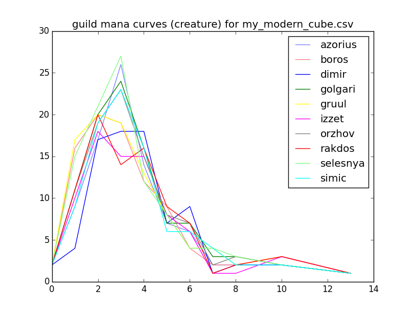

## Cubealyzer

A curve analysis tool for Magic: the Gathering cubes.

Mana curves are considered for each "faction" (color, guild, shard, wedge, and
nephilim), and are calculated based on the number of creatures (or other
permanents) available to a hypothetical deck with access to mana of only the
corresponding colors. Further analysis based on other card properties, such as
tribe, is supported but unimplemented.

A cube file should be provided as input via the positional argument. This
should contain the cards appearing in the cube, one per line. If there are
multiple copies of a card, that line should be repeated. This format was chosen
because it is compatible with the [cubetutor](https://www.cubetutor.com/) CSV
output (columns besides the first are ignored).

Uses [Scryfall](https://scryfall.com/docs/api/) to fetch card data. This data
will be downloaded and stored in a JSON file with the same base name as the CSV
file (e.g., my_modern_cube.json for my_modern_cube.csv.) This allows you
observe the result of incremental changes to a cube without unnecessary API
queries. These JSON files can eventually grow rather unwieldy, so try deleting
them if you're having problems. Note that the JSON file does not itself
represent the cube.

## Usage
```
usage: cubealyzer.py [-h] [-t [type]] [--subtype [subtype]] [-c] [-g] [-s]
                     [-w] [-n] [--plot] [--test]
                     [FILE]

Curve analysis tool for Magic: the Gathering cubes.

positional arguments:
  [FILE]               The cube file (cubetutor CSV export)

optional arguments:
  -h, --help           show this help message and exit
  -t [type]            The card type to calculate curves for (default:
                       creature)
  --subtype [subtype]  The card subtype to calculate curves for (default:
                       none)
  -c                   Calculate curves for colors
  -g                   Calculate curves for guilds
  -s                   Calculate curves for shards
  -w                   Calculate curves for wedges
  -n                   Calculate curves for nephilim
  --plot               Display plots of generated curves
  --test               Generate tests
```

## Example

Using [psyllogism's Modern Cube](http://www.cubetutor.com/viewcube/75206):

$ python3  ./cubealyzer.py -cg --plot my_modern_cube.csv
Total cards playable in:
black       177
blue        171
green       181
red         178
white       174
Cards of type creature playable in:
black       53
blue        45
green       58
red         51
white       56
Cards of type creature at each cost in:
black       1: 3 2:13 3:11 4:11 5: 4 6: 5 7: 2 8: 1 9: 0 10: 2 11: 0 12: 0 13: 1
blue        1: 1 2: 9 3:12 4:10 5: 3 6: 4 7: 2 8: 1 9: 0 10: 2 11: 0 12: 0 13: 1
green       1: 8 2:12 3:16 4: 8 5: 3 6: 2 7: 4 8: 2 9: 0 10: 2 11: 0 12: 0 13: 1
red         1: 9 2:12 3: 8 4: 8 5: 5 6: 2 7: 2 8: 1 9: 0 10: 3 11: 0 12: 0 13: 1
white       1: 8 2:11 3:16 4: 7 5: 4 6: 2 7: 3 8: 2 9: 0 10: 2 11: 0 12: 0 13: 1
Total cards playable in:
azorius     235
boros       240
dimir       234
golgari     247
gruul       246
izzet       238
orzhov      239
rakdos      241
selesnya    241
simic       240
Cards of type creature playable in:
azorius     86
boros       89
dimir       80
golgari     95
gruul       92
izzet       79
orzhov      92
rakdos      86
selesnya    97
simic       88
Cards of type creature at each cost in:
azorius     1: 9 2:17 3:26 4:14 5: 7 6: 5 7: 3 8: 2 9: 0 10: 2 11: 0 12: 0 13: 1
boros       1:16 2:20 3:20 4:12 5: 9 6: 3 7: 3 8: 2 9: 0 10: 3 11: 0 12: 0 13: 1
dimir       1: 4 2:19 3:18 4:18 5: 7 6: 8 7: 2 8: 1 9: 0 10: 2 11: 0 12: 0 13: 1
golgari     1:11 2:22 3:24 4:16 5: 7 6: 6 7: 4 8: 2 9: 0 10: 2 11: 0 12: 0 13: 1
gruul       1:17 2:20 3:20 4:13 5: 8 6: 3 7: 5 8: 2 9: 0 10: 3 11: 0 12: 0 13: 1
izzet       1:10 2:18 3:16 4:15 5: 8 6: 5 7: 2 8: 1 9: 0 10: 3 11: 0 12: 0 13: 1
orzhov      1:11 2:21 3:23 4:15 5: 8 6: 6 7: 3 8: 2 9: 0 10: 2 11: 0 12: 0 13: 1
rakdos      1:11 2:22 3:15 4:16 5: 9 6: 6 7: 2 8: 1 9: 0 10: 3 11: 0 12: 0 13: 1
selesnya    1:15 2:21 3:27 4:12 5: 8 6: 3 7: 5 8: 3 9: 0 10: 2 11: 0 12: 0 13: 1
simic       1: 9 2:19 3:23 4:16 5: 6 6: 5 7: 5 8: 2 9: 0 10: 2 11: 0 12: 0 13: 1




## Issues

How to handle split cards? (e.g., Fire // Ice)? This is functionally
similar to two independent cards, yet only one can go in a given deck.

Current implementation uses only the first half.

## Notes

The four color faction names are from Commander 2016. (See [Multicolored#Four_colors](https://mtg.gamepedia.com/index.php?title=Multicolored&oldid=279219#Four_colors))
