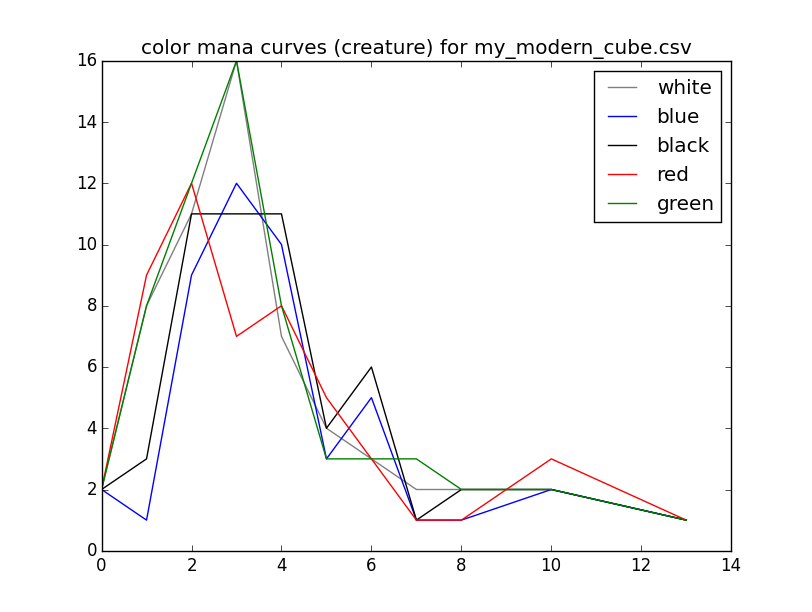

## Cubealyzer

A curve analysis tool for Magic: the Gathering cubes.

Uses [Deckbrew](https://deckbrew.com/api/) to fetch card details. These will be downloaded and stored in a JSON file with the same base name as the input file (e.g., my_modern_cube.json for my_modern_cube.csv.)

## Usage
```
usage: cubealyzer.py [-h] [-t [type]] [-c] [-g] [-s] [-w] [--plot] [--test]
                     [FILE]

Curve analysis tool for Magic: the Gathering cubes

positional arguments:
  [FILE]      The cube file (cubetutor CSV export)

optional arguments:
  -h, --help  show this help message and exit
  -t [type]   The card type to calculate curves for (default: creature)
  -c          Calculate curves for individual colors
  -g          Calculate curves for guilds
  -s          Calculate curves for shards
  -w          Calculate curves for wedges
  --plot      Display plots of generated curves
  --test      Generate tests
```

## Example

Using [psyllogism's Modern Cube](http://www.cubetutor.com/viewcube/75206):

```
$ ./cubealyzer.py -c -g --plot my_modern_cube.csv
Total cards playable in:
white       175
blue        169
black       178
red         178
green       181
Cards of type creature playable in:
white       40
blue        28
black       37
red         34
green       41
Cards of type creature at each cost in:
black       1: 3 2:10 3: 8 4: 8 5: 4 6: 4 
blue        1: 1 2: 6 3: 8 4: 7 5: 3 6: 3 
green       1: 8 2: 9 3:12 4: 5 5: 3 6: 1 7: 2 8: 1 
red         1: 9 2: 9 3: 4 4: 5 5: 5 6: 1 10: 1 
white       1: 9 2: 8 3:12 4: 4 5: 4 6: 1 7: 1 8: 1 
Total cards playable in:
azorius     234
boros       241
dimir       233
golgari     248
gruul       246
izzet       236
orzhov      241
rakdos      242
selesnya    242
simic       238
Cards of type creature playable in:
azorius     70
boros       73
dimir       64
golgari     79
gruul       75
izzet       62
orzhov      77
rakdos      70
selesnya    81
simic       71
Cards of type creature at each cost in:
azorius     1:10 2:14 3:22 4:11 5: 7 6: 4 7: 1 8: 1 
boros       1:17 2:17 3:16 4: 9 5: 9 6: 2 7: 1 8: 1 10: 1 
dimir       1: 4 2:16 3:15 4:15 5: 7 6: 7 
golgari     1:11 2:19 3:21 4:13 5: 7 6: 5 7: 2 8: 1 
gruul       1:17 2:17 3:16 4:10 5: 8 6: 2 7: 3 8: 1 10: 1 
izzet       1:10 2:15 3:12 4:12 5: 8 6: 4 10: 1 
orzhov      1:12 2:18 3:20 4:12 5: 8 6: 5 7: 1 8: 1 
rakdos      1:11 2:19 3:12 4:13 5: 9 6: 5 10: 1 
selesnya    1:16 2:18 3:23 4: 9 5: 8 6: 2 7: 3 8: 2 
simic       1: 9 2:16 3:19 4:13 5: 6 6: 4 7: 3 8: 1 
```



